# Unidade Lógica e Aritmétrica (ULA) de 8 bits

&emsp; O projeto é o desenvolvimento de uma Unidade Lógica e Aritmétrica (ULA) de 8 bits utilizando o simulador Digital. A ULA é um dos componentes mais importantes, considerado como o coração do processador, ele é responsável por realizar operações aritmétricas e lógica dentro dele.

&emsp; O sistema foi construído utilizando uma arquitetura baseada em registradores, onde o Acumulador (AC) armazena os resultados principais e o MQ (Multiplier/Quotient) lida com operações estendidas de multiplicação e divisão. O operando de entrada é representado por N.

## Operações Implementadas

### Soma
**Operação:** AC + N -> AC (8 bits)

&emsp; Para a implementação da soma, comecei construindo a tabela verdade para a soma de 1 bit, que inclui as entradas A, B e o Carry In (Cin), e as saídas Sum e Carry Out (Cout). Com base na tabela, realizei 2 mapas de Karnaugh para conseguir as expressões de Sum e Cout.

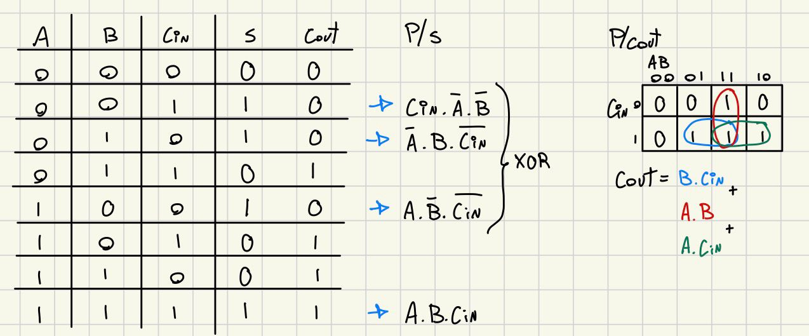

&emsp; As expressões obtidas foram:
- Sum = A XOR B XOR Cin
- Cout = (A AND B) OR (Cin AND A) OR (Cin AND B)

&emsp; Depois de encontrar as expressões, construi um somador de 1 bit utilizando: três entradas (A, B, Cin) e duas saídas (Sum, Cout). Assim adicionei uma porta lógica XOR e três portas AND para obter o resultado da soma.

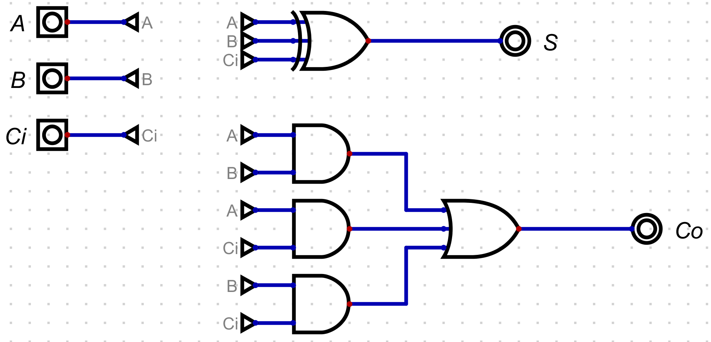

&emsp; Apartir do somador de 1 bit, salvei ele com um componente e para construir o somador de 8 bits, utilizei 8 somadores de 1 bit que são interligados, onde o primeiro somador recebe o terra como Carry In (Cin) e o Carry Out (Cout) é conectado ao Carry In (Cin) do próximo somador, e assim por diante até o último somador. Então, o resultado da soma de 8 bits é obtido a partir dos Sum de cada somador e o Carry Out do último somador.

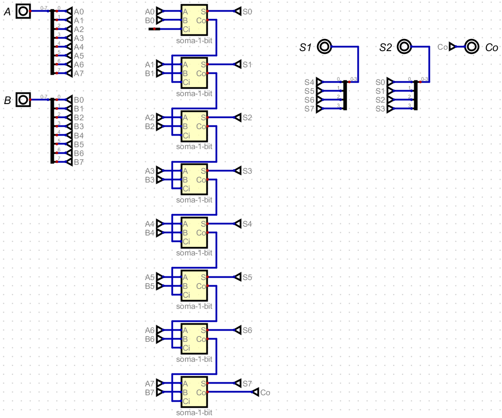

### Subtração
**Operação:** AC - N -> AC (8 bits)

&emsp; Para a implementação da subtração, comecei construindo a tabela verdade para a subtração de 1 bit, que inclui as entradas A, B e o Borrow In (Bin), e as saídas Diff e Borrow Out (Bout). Com base na tabela, realizei 2 mapas de Karnaugh para conseguir as expressões de Diff e Bout.

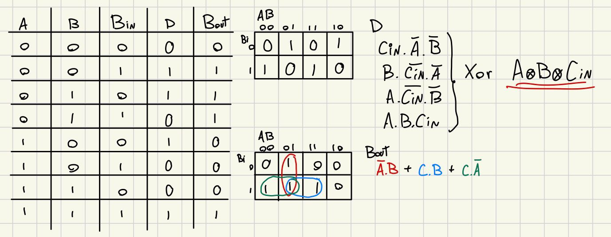

&emsp; As expressões obtidas foram:
- Diff = A XOR B XOR Bin
- Bout = (NOT A AND B) OR (Bin AND NOT A) OR (Bin AND B)

&emsp; Depois de encontrar as expressões, construí um subtrator de 1 bit utilizando: três entradas (A, B, Bin) e duas saídas (Diff, Bout). No sistema, adicionei uma porta lógica XOR e três portas AND, em duas delas adicionei uma porta NOT para que a entrada A seja invertida, assim obtendo o resultado da subtração.

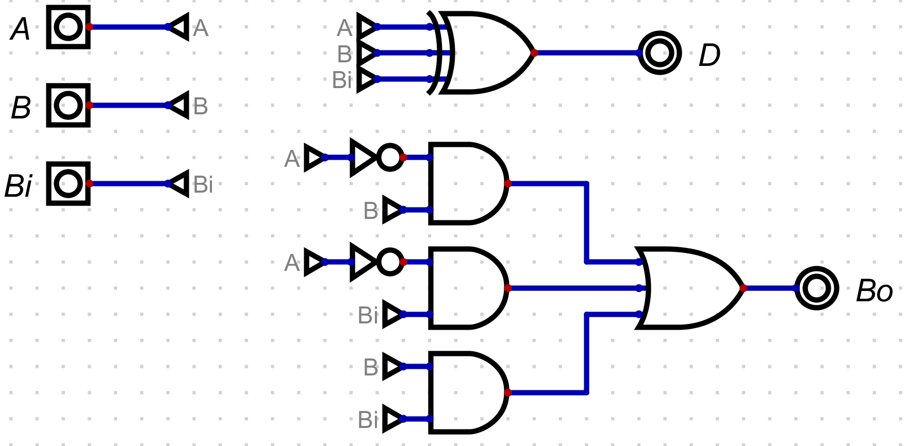

&emsp; A partir do subtrator de 1 bit, salvei ele com um componente e para construir o subtrator de 8 bits, utilizei 8 subtratores de 1 bit que são interligados, onde o primeiro subtrator recebe o terra como Borrow In (Bin) e o Borrow Out (Bout) é conectado ao Borrow In (Bin) do próximo subtrator, e assim por diante até o último subtrator. Então, o resultado da subtração de 8 bits é obtido a partir dos Diff de cada subtrator e o Borrow Out do último subtrator.

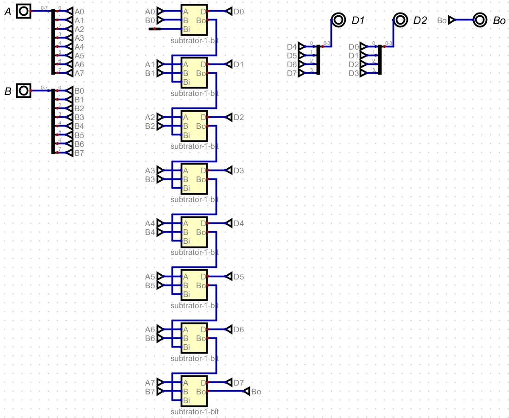

### Multiplicação
**Operação:** AC * N -> AC (8 LSB) e MQ (8 MSB)

&emsp;A multiplicação de 8 bits é considerada a operação mais complexa da ULA, pois envolve a geração de produtos parciais e a soma sucessiva desses valores com deslocamentos, assim como uma multiplicação decimal. Para realizar multiplicação binária de 8 bits, utilizei a arquitetura de Multiplicador de Matriz, que processa a conta de maneira combinacional.

- **Conceito:** Na multiplicação binária, cada bit da entrada A (8 bits) deve ser multiplicado por cada bit da entrada B (8 bits), o que gera uma matriz de 64 (8 X 8). Se fizermos a multiplicação de 1 bit por 1 bit, descobrimos que o resultado é igual a porta lógica AND, ou seja, o resultado é 1 apenas quando ambos os bits são 1, caso contrário, o resultado é 0:

    1 x 1 = 1 | (A AND B) = 1; 
    1 x 0 = 0 | (A AND B) = 0; 
    0 x 0 = 0 | (A AND B) = 0; 

Com isso, na construção do multiplicador de 8 bits, adicionei 64 portas AND, garantindo que todos os números sejam multiplicados por todos os números individualmente. Na imagem é possível visualizar as 64 portas AND, as duas entradas (A e B) e duas saídas divididas entre LSB (Least Significant Bits) e MSB (Most Significant Bits) para armazenar o resultado da multiplicação.

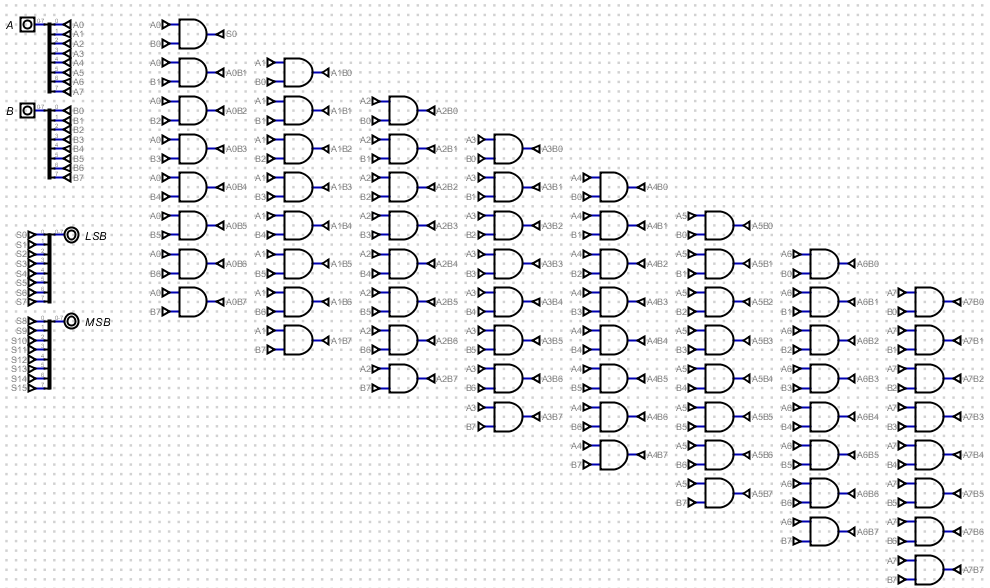

- **Soma:** Para construir a multiplicação, pensei como se fosse uma multiplicação no papel, onde após a multiplicação, é necessário somar os produtos. Então, organizei as portas lógicas AND para que elas ficassem estruturadas em linhas, em que cada linha é preciso fazer a multiplicação do resultado daquela porta lógica AND, assim resultando em 1 bit do resultado da multiplicação. 

A lógica está funcionando assim:
- A linha 1 é fácil, apenas multiplicar (com uma porta lógica AND, provamos isso com a tabela verdade) A0 com B0 e temos o bit menos significativo do resultado. 
- Já a linha 2, precisamos multiplicar o produto de A0 e B1 com o produto de A1 e B0 (portas AND), isso gera dois produtos, então adicionei o meu somador de 1 bit para somar esses dois produtos, e o resultado é o segundo bit menos significativo do resultado. 
- Para a linha 3, multiplico A0 e B2, A1 e B1, A2 e B0 (portas AND), isso gera três produtos, então adicionei 2 somadores de 1 bit em que, no primeiro somador, o produto de A0 e B2 são somados com o produto de A1 e B1, resultando em um valor SS2, no segundo somador, SS2 é somado com o produto de A2 e B0, resultando no terceiro bit menos significativo do resultado, um detalhe importante é que, nesse primeiro somador dessa 3° linha, adiciono o Co0 (Cout da linha anterior) como Cin desse somador, para garantir que a soma seja realizada corretamente. 
- A lógica continua até todos os bits serem multiplicados (64 vezes, por conta das portas AND) e depois somados com os 56 somadores adicionados.

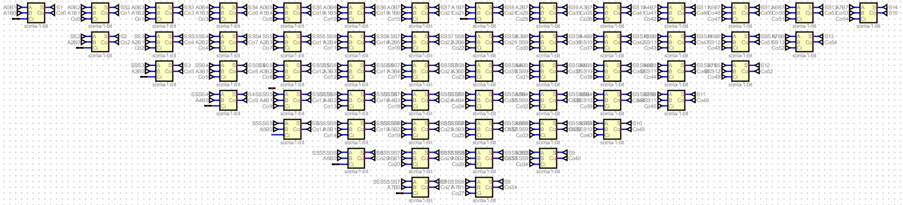

- **Resultado:** Com todos os bits de entrada multiplicados e somados em suas respectivas posições, pulando uma casa para a esquerda assim como na multiplicação manual, temos o produto da multiplicação de 8 bits que pode gerar um número de até 16 bits, por isso dividi em duas saídas, a LSB (Least Significant Bits) utilizando S0 até S7 e a saída MSB (Most Significant Bits) utilizando o S8 até o S15.

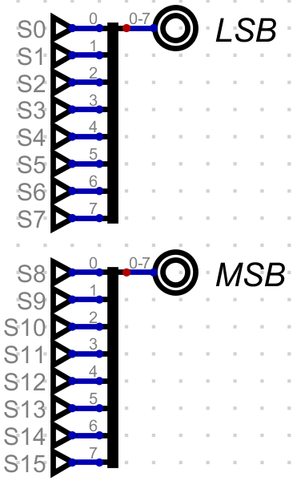

&emsp; O multipicador de 8 bits ficou dessa maneira:

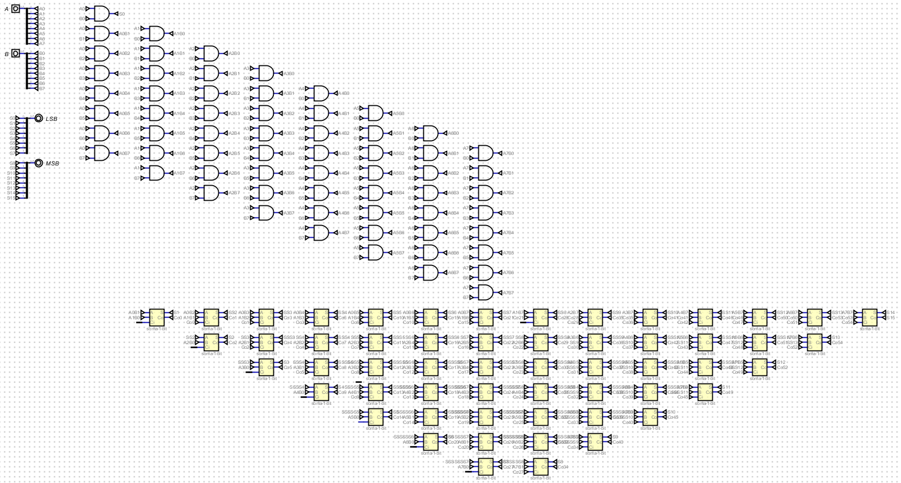

### Divisão
**Operação:** AC / N -> AC (Resto) e MQ (Quociente)

### Shift Lógico à Esquerda
**Operação:** AC -> AC (8 bits)

&emsp; Para a implementação do shift lógico à esquerda, utilizei um componente de 8 bits onde cada bit é conectado ao próximo bit, ou seja, o bit 0 da entrada é conectado ao bit 1 da saída, o bit 1 da entrada é conectado ao bit 2 da saída, e assim por diante, até o bit 6 da entrada que é conectado ao bit 7 da saída. O bit 0 da saída é conectado ao terra, pois no shift lógico à esquerda, o bit mais à direita é preenchido com zero.

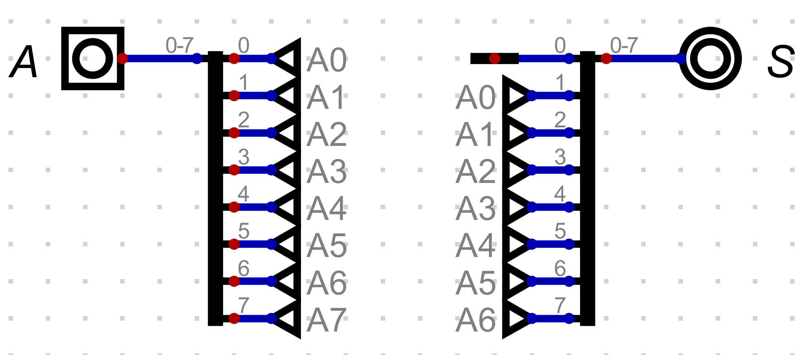

&emsp; O resultado do shift lógico à esquerda resulta no dobro do valor colocado na entrada, isso porque cada bit é deslocado para a esquerda, o que equivale a multiplicar o valor por 2. Por exemplo, se a entrada for 00000001 (1 em decimal), o resultado do shift lógico à esquerda será 00000010 (2 em decimal). Se a entrada for 00000010 (2 em decimal), o resultado será 00000100 (4 em decimal), e assim por diante.

### Shift Lógico à Direita
**Operação:** AC -> AC (8 bits)

&emsp; Para a implementação do shift lógico à direita, utilizei um componente de 8 bits onde cada bit é conectado ao próximo bit, ou seja, o bit 7 da entrada é conectado ao bit 6 da saída, o bit 6 da entrada é conectado ao bit 5 da saída, e assim por diante, até o bit 1 da entrada que é conectado ao bit 0 da saída. O bit 7 da saída é conectado ao terra, pois no shift lógico à direita, o bit mais à esquerda é preenchido com zero.

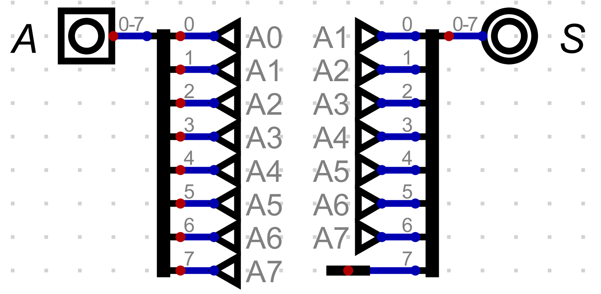

&emsp; O resultado do shift lógico à direita resulta na metade do valor colocado na entrada, isso porque cada bit é deslocado para a direita, o que equivale a dividir o valor por 2. Por exemplo, se a entrada for 00000010 (2 em decimal), o resultado do shift lógico à direita será 00000001 (1 em decimal). Se a entrada for 00000100 (4 em decimal), o resultado será 00000010 (2 em decimal), e assim por diante.

### NAND
**Operação:** AC NAND N -> AC (8 bits)

&emsp; Para a implementação da operação NAND, utilizei duas entradas (A e B), configuradas com 8 bits, e então liguei essas entradas em uma porta lógica NAND e a saída da porta NAND é conectada na saída S.

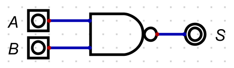

&emsp; O resultado da operação NAND é o inverso da operação AND. Ou seja, se ambos os bits de A e N forem 1, o resultado será 0, caso contrário, o resultado será 1. Por exemplo, se A for 00000011 (3 em decimal) e N for 00000001 (1 em decimal), o resultado da operação NAND será 11111110 (254 em decimal), pois apenas o bit 0 de A e N são ambos 1, resultando em um bit 0 na saída, enquanto os outros bits resultam em 1.

### XOR
**Operação:** AC XOR N -> AC (8 bits)

&emsp; Para a implementação da operação XOR, utilizei duas entradas (A e B), configuradas com 8 bits, e então liguei essas entradas em uma porta lógica XOR e a saída da porta XOR é conectada na saída S.

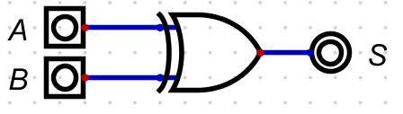

&emsp; O resultado da operação XOR é 1 se os bits de A e N forem diferentes, e 0 se forem iguais. Por exemplo, se A for 00000011 (3 em decimal) e N for 00000001 (1 em decimal), o resultado da operação XOR será 00000010 (2 em decimal), pois apenas o bit 0 de A e N são diferentes, resultando em um bit 1 na saída, enquanto os outros bits resultam em 0.

## Link do Video